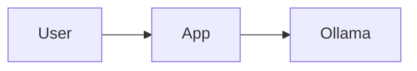

# The MD-AI Markdown dialect

The exact Markdown flavor MD-renderer understands and that the built-in system
prompt ([`SYSTEM_PROMPT.md`](./SYSTEM_PROMPT.md)) asks the model to produce.
Keeping the **parser** and the **prompt** pinned to this one document is how we
prevent drift.

> ⚠️ Examples are illustrative. This is a *spec*, not shipped code.

---

## 1. Base: GitHub-Flavored Markdown

Everything in GFM is supported: headings, **bold**/*italic*, lists, task lists,
tables, blockquotes, links, images, autolinks, `inline code`, strikethrough,
footnotes, horizontal rules, hard line breaks.

---

## 2. Headings / titles

- Use ATX headings (`#`, `##`, …). The model should start document sections at
  `##` (the app owns `#`); the renderer also **clamps** levels defensively.
- Every heading gets an auto `id` slug and a hover anchor; headings feed the TOC.

```markdown
## Overview
### Details
```

---

## 3. Code blocks

Always fence code and **always tag the language**. Optional metadata rides on the
info string.

````markdown
```ts title="server.ts"
export const port = 11434;
```
````

Supported info-string keys (all optional):

| Key | Effect |
|-----|--------|
| `title="…"` | filename header on the block |
| `{1,3-5}` or `hl=1,3-5` | highlight specific lines |
| ` ```diff ` | added/removed line tinting |

### HTML code specifically

- ` ```html ` → shown as **highlighted source**.
- If HTML preview is enabled, the block also offers a **Preview tab** that
  renders inside a **sandboxed iframe** (never same-origin).

````markdown
```html
<button class="primary">Click me</button>
```
````

---

## 4. Thinking / reasoning blocks

Reasoning goes in a thinking block, kept separate from the final answer.

**Preferred form** (XML-style, matches common models like DeepSeek-R1):

```text
<think>
Weigh the approaches, sketch the algorithm, check edge cases…
</think>
```

Also accepted (normalized to the same panel):

- `<thinking> … </thinking>`
- a fenced ` ```thinking … ``` ` block

Rules the renderer relies on:

1. Thinking content appears **before** the final answer.
2. It is **excluded** from "copy answer" and from any downstream parsing of the
   final response.
3. A thinking block that never closes before the stream ends is closed
   gracefully and marked incomplete.

---

## 5. Math

- Inline: `$E = mc^2$`
- Block:
  ```text
  $$
  \int_0^1 x^2 \, dx = \tfrac{1}{3}
  $$
  ```

Rendered with KaTeX.

---

## 6. Diagrams (optional)

Fenced ` ```mermaid ` blocks render as diagrams (lazy-loaded).

````markdown

````

---

## 7. Callouts / admonitions (optional)

GitHub-style alert blockquotes:

```markdown
> [!NOTE]
> Helpful context.

> [!WARNING]
> Something to watch out for.
```

Supported: `NOTE`, `TIP`, `IMPORTANT`, `WARNING`, `CAUTION`.

---

## 8. Raw HTML policy

- Raw HTML is allowed but **sanitized** (DOMPurify allowlist). `<script>`, inline
  `on*` handlers, and `javascript:`/unsafe `data:` URLs are stripped.
- To *display* HTML rather than execute it, put it in a ` ```html ` code block.
- The model is instructed to prefer Markdown over raw HTML and to use code blocks
  when showing HTML source.

---

## 9. Quick conformance checklist (for the parser & prompt)

- [ ] Code fences always carry a language tag.
- [ ] Reasoning is wrapped in a recognized thinking form and precedes the answer.
- [ ] Sections use `##`+ headings (app owns `#`).
- [ ] Math uses `$`/`$$`; diagrams use ` ```mermaid `.
- [ ] Raw HTML is minimized; HTML *source* goes in ` ```html ` blocks.
- [ ] No `<script>` / event-handler attributes in raw HTML.
